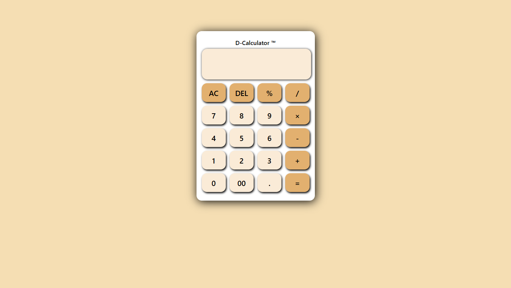
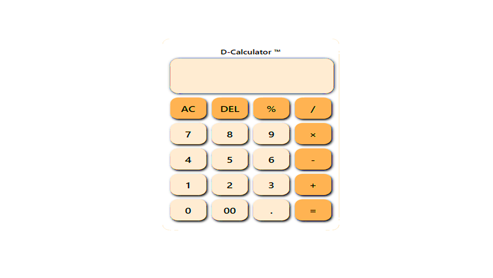

<!DOCTYPE html>
<html lang="en">
<head>
  <meta charset="UTF-8">
  
</head>
<body>

  <h1>🧮 D-Calculator™</h1>

  

    A simple yet elegant web-based calculator built as a personal learning project using <strong>HTML</strong>, <strong>CSS</strong>, and <strong>JavaScript</strong>.
    This project helps reinforce DOM manipulation, styling, and basic logic implementation using native web technologies.
  

  <h2>📸 Screenshots</h2>

  <table>
    <tr>
      <th>Desktop View</th>
      <th>Mobile View</th>
    </tr>
    <tr>
      <td></td>
      <td></td>
    </tr>
  </table>

  <h2>🎯 Features</h2>
  <ul>
    <li>✅ Perform basic arithmetic operations: <code>+</code>, <code>-</code>, <code>×</code>, <code>/</code>, <code>%</code></li>
    <li>✅ Clear display (<code>AC</code>) and delete input (<code>DEL</code>)</li>
    <li>✅ Click-based interaction (no keyboard input required)</li>
    <li>✅ Responsive layout for mobile devices</li>
    <li>✅ Press animations on button click</li>
  </ul>

  <h2>🖌️ UI & Animations</h2>
  
<strong>Layout:</strong> The calculator UI is organized using CSS Grid and styled with box shadows and rounded corners.

  
<strong>Animations:</strong>

  <ul>
    <li><strong>Button Press:</strong> Buttons slightly move down when clicked</li>
    <li><strong>Hover Effects:</strong> Operator buttons have color changes</li>
  </ul>

  <h2>📁 Project Structure</h2>
  <pre><code>📁 DTC-Calculator
├── index.html        # Markup layout
├── style.css         # Styling and responsiveness
├── script.js         # Button logic and calculations
└── assets/           # (Optional) Folder for images and GIFs
</code></pre>

 <h2>🚀 Getting Started</h2>

<h3>📦 Option 1: Download as ZIP</h3>
<ol>
  <li>Click the green <strong>"Code"</strong> button at the top of the repository.</li>
  <li>Select <strong>"Download ZIP"</strong>.</li>
  <li>Extract the ZIP file on your computer.</li>
  <li>Open <code>index.html</code> in your browser to run the calculator.</li>
</ol>

<h3>🔁 Option 2: Clone via Git (for Git users)</h3>
<ol>
  <li>Make sure you have <a href="https://git-scm.com/downloads" target="_blank">Git installed</a>.</li>
  <li>Open a terminal or command prompt.</li>
  <li>Run the following command (replace the URL with your repo):</li>
</ol>
<pre><code>git clone https://github.com/MrDino-Tz/dtc-calculator.git</code></pre>
<ol start="4">
  <li>Navigate into the project folder:</li>
</ol>
<pre><code>cd dtc-calculator</code></pre>
<ol start="5">
  <li>Open <code>index.html</code> in your browser.</li>
</ol>

  <h2>🛠️ Tech Stack</h2>
  <ul>
    <li>HTML5</li>
    <li>CSS3</li>
    <li>Vanilla JavaScript (DOM, <code>eval</code>, event listeners)</li>
  </ul>

  <h2>🙋‍♂️ Author</h2>
  
<strong>MrDino-Tz</strong> 
  <a href="https://github.com/MrDino-Tz">GitHub Profile</a>

  <h2>📌 Note</h2>
  

    This calculator is built for learning purposes and may not handle complex expressions like parentheses or chained operations.
    For more advanced calculators, consider using React or Vue.
  

</body>
</html>

